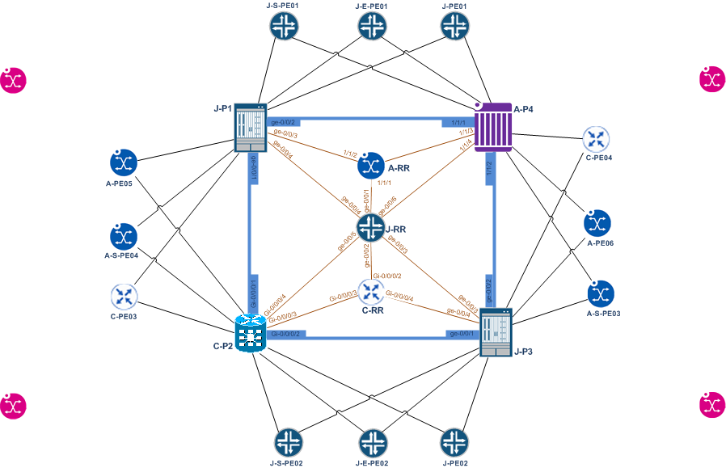

# IaC_Multivendor_MPLS_Network
Infrastructure/Network as Code for a Multivendor IP-MPLS Service Provider Network comprising of following vendor devices/OS:

1. Cisco IOSXR
2. Juniper JUNOS
3. Nokia SROS

Ansible and jinja templates are used for configuration generation for each device defined in hosts file.

The vendor Network Operating system for any node can be seamlessly changed by associating that node to the specific vendor OS group in the Ansible hosts file.

PE01 is currently a child of J-PE, which is a child of JNPR. For instance, to swap PE01 to Nokia SROS, PE01 needs to be a child of A-PE, and the playbooks re-run to re-generate all the relevant configuration for that specific vendor OS.

# Example Network Topology



Example topology includes P & PE routers and BGP route-reflectors. 
The templates only consist of configuration for the Transport network:

1. RSVP full-mesh between P routers
2. LDP between PE & P routers
3. LDPoRSVP tunneling
4. IGP: OSPF multi-area
5. MP-BGP control plane

In this topology, Route reflectors (RRs) are assumed out-of-band.
An RR can be changed to in-band by also adding it as a child member of P routers. 

*Example:*
```
[P: children]
J-P
C-P
A-P
J-RRC
#RR             # Add group RR here to transform RR routers into Transit P routers. This will enable mpls/rsvp interface on 
```
